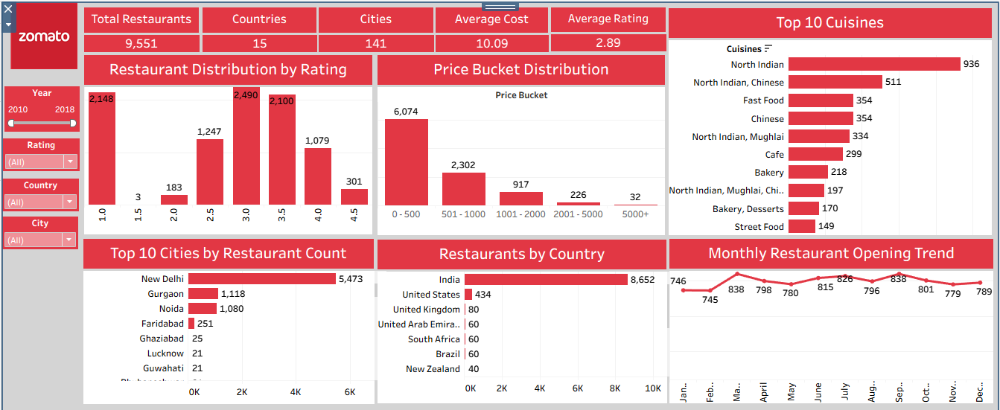
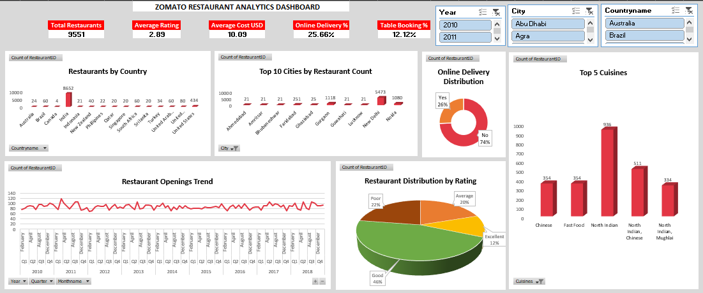

# 🍽️ Zomato Restaurant Analysis

---

## 📌 Project Overview

This repository contains an end-to-end data analytics project developed using **SQL, Microsoft Excel, Tableau, and Power BI**. The project analyzes the Zomato restaurant dataset to uncover meaningful business insights related to restaurant performance, customer ratings, pricing, online delivery, table booking, and geographic distribution.

The same business problem has been solved using multiple analytics tools to demonstrate proficiency across the complete data analytics workflow.

---

## 🎯 Business Objectives

* Analyze restaurant distribution across countries and cities
* Evaluate customer ratings and restaurant performance
* Compare average cost for two across different locations
* Analyze online delivery and table booking availability
* Identify cuisine and price range trends
* Build interactive dashboards for business decision-making

---

## 🛠 Tools & Technologies

| Tool | Purpose |
|------|---------|
| SQL | Data Cleaning & Analysis |
| Microsoft Excel | Data Analysis & Dashboard |
| Tableau | Interactive Dashboard |
| Power BI | Business Intelligence Dashboard |
| Power Query | Data Transformation |
| DAX | KPI & Measure Calculations |

---

## 📊 Dashboard Preview

### Power BI Dashboard

---

### Tableau Dashboard

---

### Excel Dashboard

---

## 📈 Key Performance Indicators (KPIs)

* 🍴 Total Restaurants
* 🌍 Total Countries
* 🏙️ Total Cities
* ⭐ Average Rating
* 💰 Average Cost for Two
* 🚚 Online Delivery %
* 🍽️ Table Booking %
* 📅 Restaurant Openings by Year

---

## 📊 Dashboard Features

### SQL

* Data Cleaning
* Data Exploration
* Multiple Table Joins
* Business KPI Queries
* Date-Based Analysis
* Restaurant Performance Analysis

### Excel

* Pivot Tables
* Pivot Charts
* KPI Dashboard
* Interactive Slicers
* Dynamic Reports

### Tableau

* Interactive Restaurant Dashboard
* Country & City Analysis
* Rating Analysis
* Cost Analysis
* Cuisine Analysis
* Dynamic Filters

### Power BI

* Executive Dashboard
* KPI Cards
* Interactive Maps
* Online Delivery Analysis
* Table Booking Analysis
* Rating Distribution
* Cuisine Analysis
* Interactive Slicers

---

## 💡 Key Insights

* Identified countries and cities with the highest restaurant concentration.
* Compared restaurant ratings across different regions.
* Analyzed average cost for two to understand pricing trends.
* Evaluated adoption of online delivery and table booking services.
* Identified popular cuisines and their distribution across locations.
* Built interactive dashboards to support business decision-making.

---

## 📚 Skills Demonstrated

* SQL
* Data Cleaning
* Data Transformation (ETL)
* Data Modeling
* Excel Analytics
* Dashboard Development
* Data Visualization
* Power Query
* DAX
* Tableau
* Power BI
* Business Intelligence
* Analytical Thinking
* Storytelling with Data

---

## 📁 Dataset

The dataset used in this project is included in the repository.

📥 [Download Dataset](Datasets.zip)

> Note: If GitHub cannot preview the ZIP file directly, download and extract it to access the dataset.

---

## 🚀 How to Use

1. Clone this repository.
2. Extract the dataset (if compressed).
3. Open the SQL script in your preferred SQL environment.
4. Open the Excel workbook using Microsoft Excel.
5. Open the Tableau workbook using Tableau Desktop/Public.
6. Open the Power BI file using Power BI Desktop.

> Large project files are managed using Git LFS.

---

## 👨‍💻 Author

**Khushal Panchal**

Data Analyst | SQL | Excel | Power BI | Tableau | Python

### Connect with Me

- LinkedIn: [Khushal Panchal](https://www.linkedin.com/in/khushal-panchal-4b629324a)
- GitHub: [KPanchal69](https://github.com/KPanchal69)

---

⭐ If you found this project useful, consider giving it a star!
